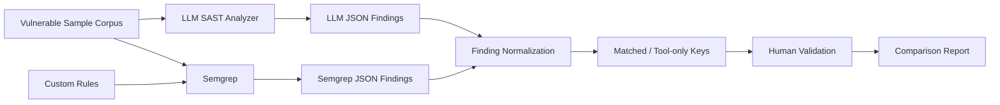

# LLM vs Semgrep SAST Comparison

[](./llm-sast/requirements.txt)
[](./semgrep-sast/rules)
[](./llm-sast/analyzer.py)
[](./docs/METHODOLOGY.md)
[](https://github.com/syifaniads/llm-semgrep-sast-comparison/actions/workflows/security-tooling-ci.yml)

A curated portfolio mirror of a collaborative security-engineering project comparing **LLM-assisted static application security testing** with **Semgrep rule-based SAST**.

The project uses intentionally vulnerable Python/JavaScript fixtures, custom Semgrep rules, an LLM analyzer, a normalized comparison engine, and explicit human-validation boundaries to study where deterministic pattern matching and model-based reasoning differ.

> **Attribution:** this was collaborative team/course work in the `dso-1` organization. This personal repository preserves team attribution and source provenance; it does not claim sole authorship of the original codebase.

<p align="center">
  
</p>

The visual above is reconstructed from the actual analyzer, custom rules, vulnerable fixtures, and comparison code in this repository. It is an implementation diagram, not a fabricated benchmark screenshot.

## Senior technical review path

A reviewer can inspect the experiment from source to interpretation:

1. **Methodology & benchmark limits:** [docs/METHODOLOGY.md](./docs/METHODOLOGY.md) and [docs/LIMITATIONS.md](./docs/LIMITATIONS.md).
2. **LLM analyzer:** [`llm-sast/analyzer.py`](./llm-sast/analyzer.py) — line-numbered source prompting, structured finding schema, JSON repair, severity/CWE/confidence fields, token/runtime capture.
3. **Deterministic rules:** [`semgrep-sast/rules/python-security.yaml`](./semgrep-sast/rules/python-security.yaml) and [`javascript-security.yaml`](./semgrep-sast/rules/javascript-security.yaml).
4. **Educational fixtures:** [`vulnerable-samples/`](./vulnerable-samples/) — deliberately insecure Python and JavaScript used only for controlled testing.
5. **Normalization/comparison:** [`comparison/compare.py`](./comparison/compare.py) — both tools are reduced into a common `Finding` representation and matched using `file + CWE/category`.
6. **Executable validation:** [`tests/test_compare.py`](./tests/test_compare.py), [`scripts/validate_semgrep_output.py`](./scripts/validate_semgrep_output.py), and the [CI workflow](./.github/workflows/security-tooling-ci.yml).
7. **Provenance:** [TEAM_ATTRIBUTION.md](./TEAM_ATTRIBUTION.md) and [SOURCE_EVIDENCE.md](./SOURCE_EVIDENCE.md).

## What is technically implemented

### LLM-assisted analyzer

[`llm-sast/analyzer.py`](./llm-sast/analyzer.py) supports Python, JavaScript, TypeScript/TSX, Java, Go, Ruby, PHP, and C# language labeling. For each selected source file it:

- reads and line-numbers source code;
- sends the source with an AppSec-focused system prompt;
- asks for JSON-only structured findings;
- handles malformed model JSON through `json-repair`;
- normalizes each finding into severity, category, CWE, line range, explanation, remediation, and confidence;
- records scan duration, model name, and token usage;
- stores machine-readable JSON for downstream comparison.

The current runtime uses an OpenAI-compatible client pointed at the NVIDIA API endpoint and requires `NVIDIA_API_KEY` from the environment. No credential is committed to the repository.

### Semgrep rule engine

The repository contains reviewable custom Python and JavaScript rules rather than only calling a generic hosted scanner. The Python rule set includes patterns for SQL injection, shell/command injection, `eval`/`exec`, path traversal, hardcoded secrets, weak hashes, unsafe pickle/YAML deserialization, and related categories. Rule metadata carries CWE/OWASP context where defined.

### Comparison engine

[`comparison/compare.py`](./comparison/compare.py) parses both output formats into the same immutable structure:

```text
Finding(
  tool,
  file,
  line,
  severity,
  category,
  cwe,
  title
)
```

For lightweight overlap analysis, it uses:

```text
identity = CWE if present else normalized category
comparison key = basename(file) + identity
```

It then reports matched keys, LLM-only keys, Semgrep-only keys, total findings, and severity distributions, and generates an HTML report. This is intentionally a **normalization heuristic**, not vulnerability ground truth.

## Experiment architecture



## Vulnerability categories in the sample corpus

The educational corpus covers themes such as SQL injection, command injection/unsafe shell execution, XSS/unsafe HTML sinks, path traversal, hardcoded secrets, weak cryptography, insecure deserialization, SSRF, XXE, open redirect, JWT misuse, and insecure randomness.

These files are **deliberately vulnerable fixtures**. They are not implementation patterns to reuse in production.

## CI proves the deterministic parts without an LLM API key

The repository's GitHub Actions workflow deliberately separates reproducible tests from the external model call:

- Python unit tests verify LLM/Semgrep result parsing, basename/CWE normalization, overlap matching, category fallback, and safe HTML escaping;
- Semgrep is installed in CI, both custom rule files are executed against the educational fixtures, and the JSON output must contain findings from **both Python and JavaScript** without Semgrep errors;
- `py_compile` validates deterministic Python entry points;
- the CI workflow does **not** call the paid/external LLM API, avoiding secret exposure, cost, and non-deterministic build failures.

This makes the repository testable on every push while keeping model-dependent experiments opt-in.

## What this comparison does — and does not — prove

Semgrep provides deterministic, reviewable rule execution suited to repeatable CI guardrails. An LLM can add contextual explanation and potentially recognize patterns that are difficult to encode as a single syntax rule, but model output is non-deterministic and can hallucinate or overstate findings.

This repository therefore does **not** claim that one approach is categorically more accurate. A rigorous accuracy benchmark would need a labeled ground-truth corpus, repeated model runs, fixed model/version/temperature, precision/recall/F1 calculations, line-level matching rules, and analyst adjudication. The current experiment is a tooling/comparison case study, not that stronger benchmark.

```text
Semgrep -> deterministic guardrails in CI
LLM     -> contextual analyst assistance
Human   -> final validation and risk judgment
```

## Quick start

```bash
python -m venv .venv
source .venv/bin/activate      # Windows: .venv\Scripts\activate
pip install -r llm-sast/requirements.txt
pip install semgrep
cp .env.example .env
```

Set your own API key in the environment and run the complete experiment:

```bash
python run_all.py
```

Or run only the deterministic Semgrep path:

```bash
python run_all.py --only-semgrep
```

Run the local comparison tests without any model credential:

```bash
python -m unittest discover -s tests -v
```

Generated scan results belong under `results/` and are intentionally ignored by Git by default.

## Security note

Do not place real secrets into the vulnerable sample corpus simply to test secret detection. Use explicit dummy values. The portfolio mirror does not preserve any real API credential. See [SECURITY.md](./SECURITY.md).

---

**Portfolio owner:** [Syifani Adillah Salsabila](https://github.com/syifaniads)  
**Project type:** Collaborative Security Tooling / SAST Experiment  
**Context:** Universitas Brawijaya — 2026
