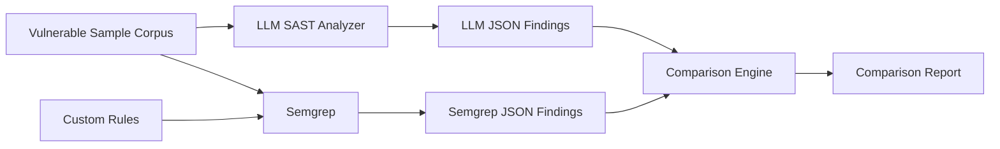

# LLM vs Semgrep SAST Comparison

[](./llm-sast/requirements.txt)
[](./semgrep-sast/rules)
[](./llm-sast/analyzer.py)
[](./docs/METHODOLOGY.md)

A curated portfolio mirror of a collaborative security-engineering project comparing **LLM-assisted static application security testing** with **Semgrep rule-based SAST**.

The project uses intentionally vulnerable Python/JavaScript samples, custom Semgrep rules, an LLM analyzer, and a comparison workflow to explore where deterministic pattern matching and model-based reasoning complement each other.

> **Attribution:** this was collaborative team/course work in the `dso-1` organization. This personal repository makes the project inspectable from my portfolio while preserving team attribution and linking back to the original source. It does not claim sole authorship of the original codebase.

## What a reviewer can inspect quickly

| Area | Evidence |
|---|---|
| Experiment methodology | [docs/METHODOLOGY.md](./docs/METHODOLOGY.md) |
| LLM analyzer | [llm-sast/analyzer.py](./llm-sast/analyzer.py) |
| Python Semgrep rules | [semgrep-sast/rules/python-security.yaml](./semgrep-sast/rules/python-security.yaml) |
| JavaScript Semgrep rules | [semgrep-sast/rules/javascript-security.yaml](./semgrep-sast/rules/javascript-security.yaml) |
| Comparison engine | [comparison/compare.py](./comparison/compare.py) |
| Master runner | [run_all.py](./run_all.py) |
| Vulnerable samples | [vulnerable-samples/](./vulnerable-samples) |
| Limitations | [docs/LIMITATIONS.md](./docs/LIMITATIONS.md) |
| Team attribution | [TEAM_ATTRIBUTION.md](./TEAM_ATTRIBUTION.md) |
| Original source | [SOURCE_EVIDENCE.md](./SOURCE_EVIDENCE.md) |
| Portfolio summary | [PORTFOLIO.md](./PORTFOLIO.md) |

## Experiment architecture



## Vulnerability categories in the sample corpus

The original lab corpus contains vulnerable and secure examples covering themes such as:

- SQL Injection;
- Command Injection / unsafe shell execution;
- XSS / unsafe HTML sinks;
- Path Traversal;
- Hardcoded Secrets;
- Weak Cryptography;
- Insecure Deserialization;
- SSRF;
- XXE;
- Open Redirect;
- JWT misuse;
- insecure randomness.

These files are **deliberately vulnerable educational fixtures**. They are not production examples.

## Comparison idea

### Semgrep

Strengths represented by this project:

- deterministic and repeatable;
- fast enough for CI/CD;
- explicit rules and reviewable patterns;
- easy mapping to CWE/OWASP metadata.

Trade-offs:

- detection quality depends on rule coverage;
- semantic/business-logic context is limited;
- pattern design can miss alternative implementations.

### LLM-assisted review

Strengths explored by this project:

- contextual reasoning over code;
- human-readable explanation and remediation;
- potential to surface patterns without a pre-written exact rule.

Trade-offs:

- non-deterministic output;
- API/model cost and latency;
- JSON-format reliability needs handling;
- findings require validation because model output can be incorrect or overconfident.

## Important interpretation

This repository does **not** claim that LLM SAST is categorically better than Semgrep, or vice versa. The useful engineering conclusion is that the two approaches have different failure modes and can be complementary:

```text
Semgrep -> deterministic guardrails in CI
LLM     -> contextual review / analyst assistance
Human   -> final validation and risk judgment
```

## Quick start

```bash
python -m venv .venv
source .venv/bin/activate      # Windows: .venv\Scripts\activate
pip install -r llm-sast/requirements.txt
pip install semgrep
cp .env.example .env
```

Set your own API key in the environment, then:

```bash
python run_all.py
```

Or run only Semgrep:

```bash
python run_all.py --only-semgrep
```

Generated scan results belong under `results/` and are intentionally ignored by Git by default.

## Security note

Do not place real secrets into the vulnerable sample corpus simply to test secret detection. Use obvious dummy values. The portfolio mirror does not preserve any real API credential. See [SECURITY.md](./SECURITY.md).

---

**Portfolio owner:** [Syifani Adillah Salsabila](https://github.com/syifaniads)  
**Project type:** Collaborative Security Tooling / SAST Experiment  
**Context:** Universitas Brawijaya — 2026