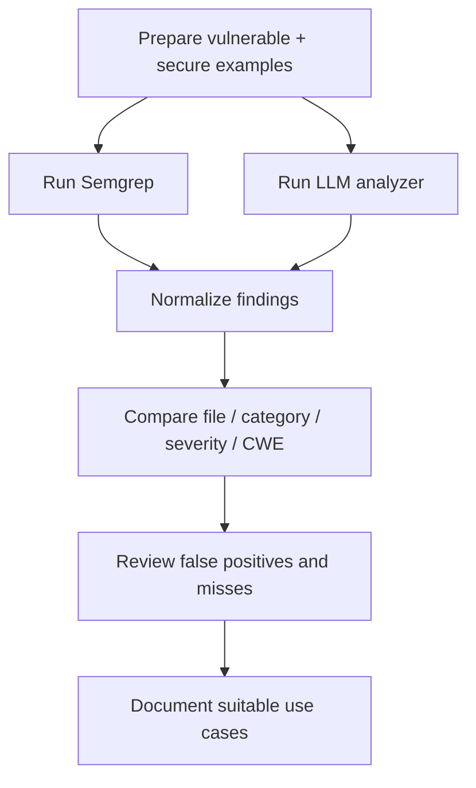

# Methodology

## Objective

Compare two static-analysis approaches over the same intentionally vulnerable code corpus:

1. **Semgrep** — deterministic, rule-based pattern matching;
2. **LLM-assisted SAST** — model-based code review returning structured vulnerability findings.

The goal is not to declare a universal winner. The useful question is how their strengths and failure modes differ, and how they can be combined in a DevSecOps workflow.

## Experiment flow

## Semgrep track

Semgrep runs registry rules together with custom project rules. The custom rules cover examples such as:

- Python SQL injection patterns;
- command injection and `shell=True`;
- dangerous `eval` / `exec` usage;
- path traversal-related file access;
- hardcoded secrets;
- weak hashes;
- unsafe deserialization;
- JavaScript SQL injection;
- XSS sinks;
- dangerous `child_process.exec` patterns;
- JWT and randomness issues.

Rule metadata includes CWE and OWASP references where available.

## LLM track

The analyzer:

1. detects source language by extension;
2. sends line-numbered source to the configured model;
3. requests JSON findings with line range, severity, category, CWE, title, explanation, remediation and confidence;
4. repairs/parses malformed JSON where possible;
5. serializes normalized results to JSON.

The current team version uses an OpenAI-compatible client pointed at an external model API. API keys are supplied through the environment and are not stored in this public repository.

## Comparison track

A normalized comparison should distinguish:

- **matched findings** — both approaches identify the same broad vulnerability in the same file;
- **Semgrep-only findings** — deterministic rule match with no corresponding LLM finding;
- **LLM-only findings** — contextual model observation with no matching Semgrep rule result;
- **false positives** — finding not supported by the intentionally labeled sample behavior;
- **misses / false negatives** — expected vulnerable pattern not identified.

## Evaluation dimensions

Useful dimensions include:

| Dimension | Why it matters |
|---|---|
| Detection coverage | Does the approach find the intentionally planted issue? |
| Precision | How many findings appear to be unsupported? |
| Determinism | Does the same input reliably produce the same result? |
| Speed | Can it reasonably run on each PR/push? |
| Cost | Is external model inference required? |
| Explanation quality | Can an analyst understand why a pattern matters? |
| Remediation quality | Is the suggested fix context-aware and usable? |
| Maintainability | Can teams review and evolve detection logic? |

## Recommended engineering use

A practical deployment model is complementary:

- use **Semgrep** as a deterministic CI/CD control for known patterns;
- use **LLM analysis** as an analyst-assistance or deeper-review layer;
- require **human validation** before treating model output as a confirmed vulnerability or production risk.

See `LIMITATIONS.md` for interpretation constraints.